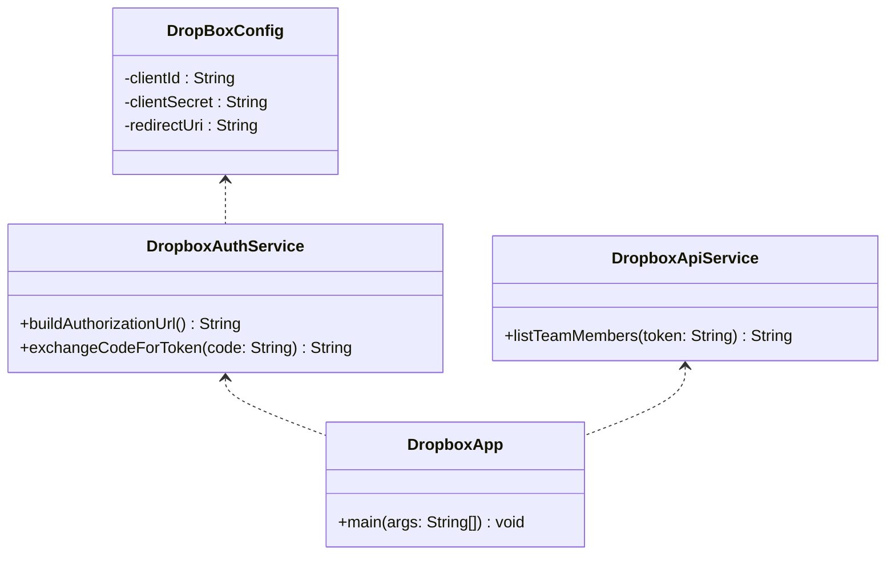

````markdown
# 📦 Dropbox API Client Assignement with Cloudeagle

A simple Dropbox API Client implemented in Java using Maven.  
This project demonstrates how to structure an OAuth 2.0 Dropbox integration in a modular and reusable way.

---

## ✨ Features

- 🔑 OAuth 2.0 Authorization with Dropbox
- 🔐 Exchange Authorization Code for Access Token
- 👥 Example API Call: List Team Members
- 🧩 OOP-based Restructure:
  - `DropBoxConfig` → Holds Dropbox App credentials (Client ID, Secret, Redirect URI)
  - `DropboxAuthService` → Manages authentication flows (Authorization URL, Token Exchange)
  - `DropboxApiService` → Handles API requests (e.g., List team members)
  - `DropboxApp` → Main class (entry point), orchestrates the flow

---

## ⚙️ Prerequisites

- ☕ Java 17+ (recommended)
- 🛠️ Maven 3.9+
- 🌐 A Dropbox App (from [Dropbox Developer Console](https://www.dropbox.com/developers))

---

## 🚀 Setup & Run

### 1️⃣ Clone the Repository

```bash
git clone https://github.com/<your-username>/dropbox-api-client.git
cd dropbox-api-client
```
````

### 2️⃣ Configure Dropbox App

Update `DropboxApp.java` with your Dropbox App credentials:

```java
DropBoxConfig config = new DropBoxConfig(
        "YOUR_CLIENT_ID",
        "YOUR_CLIENT_SECRET",
        "http://localhost:8080/callback"
);
```

### 3️⃣ Build & Run

#### Build the project

```bash
mvn clean install
```

#### Run the application

```bash
mvn exec:java
```

---

## 🖥️ Usage Flow

1. Run the app → it will print an Authorization URL.
2. Open the URL in your browser → log in & authorize the app.
3. Copy the Authorization Code and paste it back into the terminal.
4. The app will fetch your Access Token and call a Dropbox API endpoint.

Example Output:

```
Visit this URL and authorize:
https://www.dropbox.com/oauth2/authorize?client_id=XXXX...

Enter the authorization code: <paste here>
Access Token: <your-access-token>
API Response:
{ "members": [...] }
```

---

## 🧱 OOP Design Diagram



---

## 🧰 Postman Collection

I have included a Postman Collection with all Dropbox API requests used in this project.

📂 [Download the Collection](./postman/dropbox-api-collection.json)

### 🔌 Import into Postman

1. Open Postman.
2. Click Import.
3. Select the file: `postman/dropbox-api-collection.json`.
4. Use the same credentials (`client_id`, `client_secret`, `redirect_uri`) you configured in the code.

This will allow test for:

- ✅ Auth Request (Get Authorization URL)
- ✅ Token Request (Exchange code for token)
- ✅ Refresh Token Request
- ✅ Example API (List Team Members) and other given in the assignment.

---
